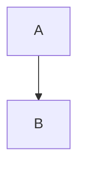

# GitHub マークダウンチートシート

**参照**: [GitHub Docs](https://docs.github.com/en/get-started/writing-on-github)

---

## 見出し

```markdown
# 見出し1
## 見出し2
### 見出し3
```

---

## 強調・装飾

| 記法 | 結果 |
|------|------|
| `*イタリック*` | *イタリック* |
| `**太字**` | **太字** |
| `~~打ち消し~~` | ~~打ち消し~~ |
| `` `code` `` | `code` |

---

## アラート（独自記法）

```markdown
> [!NOTE]
> 補足情報

> [!TIP]
> ヒント

> [!IMPORTANT]
> 重要

> [!WARNING]
> 警告

> [!CAUTION]
> 注意
```

---

## コードブロック

````markdown
```javascript
const example = "シンタックスハイライト";
```

```diff
- 削除行
+ 追加行
```
````

---

## テーブル

```markdown
| 左寄せ | 中央 | 右寄せ |
|:-------|:----:|-------:|
| A      | B    | C      |
```

---

## タスクリスト

```markdown
- [x] 完了タスク
- [ ] 未完了タスク
```

---

## 折りたたみ

```html
<details>
<summary>クリックで展開</summary>

折りたたみ内容

</details>
```

---

## 自動リンク

```markdown
#123          → Issue/PRへのリンク
@username     → ユーザーへのメンション
SHA           → コミットへのリンク
```

---

## 脚注

```markdown
本文中の参照[^1]

[^1]: 脚注の内容
```

---

## 数式（MathJax）

```markdown
$$
e^{i\pi} + 1 = 0
$$

インライン: $E = mc^2$
```

---

## mermaid ダイアグラム

````markdown

````

---

## 画像

```markdown

```

ドラッグ&ドロップでアップロード可能

---

## 絵文字

`:emoji_name:` 形式で絵文字を挿入可能

```markdown
:+1: :warning: :memo:
```
